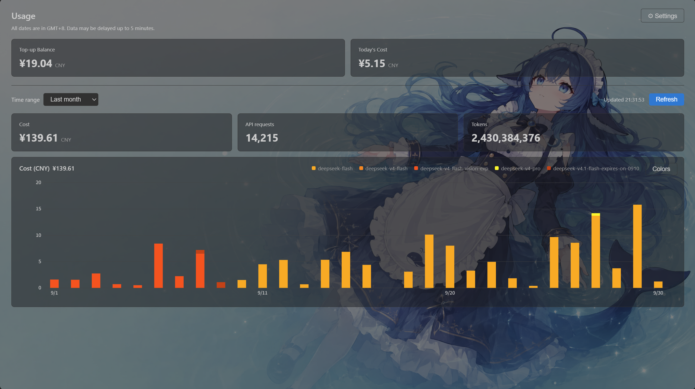

# DeepSeek Usage Monitor & Dashboard

Keep an eye on your DeepSeek API balance and usage inside VSCode: a customizable status bar readout, plus a dashboard that mirrors the look of the official usage page.

    

[简体中文](README.md) ｜ **English**

## Features: why this extension?

### 1. Highly customizable

- **Customizable status bar readout**: today's cost / this month's cost / account balance / tokens used today, shown on the right side of the status bar; the status bar label, the items shown and their order are all fully configurable
  
  
- **Customizable dashboard background**: pick an image, a solid color or a gradient; the image scales with the panel size, so it looks the way you want while keeping the information readable
  
- **Customizable colors for the official-style bar chart**: three modes — official palette / per-model colors / single base color with automatic shades — with a built-in color picker that supports RGB / HSL / HEX input
  - Official palette: the same colors the DeepSeek usage page uses
  - Per model: one color per model; models without an entry fall back to the official palette
  - Single base color: pick one color and the extension spreads it into shades, one per model, from light to dark
- **Customizable refresh interval**: set any interval you like; once a minute by default

### 2. Thoughtful details

- **A dashboard that reads at a glance:** top-up balance, today's cost, cost / API requests / tokens for a selectable range, and a per-model cost bar chart
- **Chinese and English UI**: the settings page and command titles automatically follow VSCode's global setting, while the dashboard and error notifications can be configured separately (Simplified Chinese by default)
- **API Token encrypted storage:** the API Key is kept in VSCode's SecretStorage to protect your privacy
- **HTTP proxy support**: inherited from the original project

## Configuration

Search for `deepseek-usage-monitor` in Settings, or edit `settings.json`:

| Setting                                            | Description                                                                                                                                            | Required            |
| -------------------------------------------------- | ------------------------------------------------------------------------------------------------------------------------------------------------------ | ------------------- |
| `API Key`                                          | Set it with the “Set API Key” button in the dashboard                                                                                                  | Yes                 |
| `deepseek-usage-monitor.sessionToken`              | Session Token (`Bearer ...`), used to query usage                                                                                                      | Yes                 |
| `deepseek-usage-monitor.cookie`                    | Browser Cookie, used together with the Session Token                                                                                                   | Yes                 |
| `deepseek-usage-monitor.proxy`                     | HTTP proxy URL                                                                                                                                         | No                  |
| `deepseek-usage-monitor.language`                  | Display language: `en` / `zh-cn`                                                                                                                       | No (default: zh-cn) |
| `deepseek-usage-monitor.statusBar.items`           | Which items the status bar shows (array; order = display order): `todayCost` / `monthCost` / `balance` / `todayTokens`, default `[todayCost, balance]` | No                  |
| `deepseek-usage-monitor.refreshInterval`           | Auto-refresh interval (in minutes), default `1`; decimals allowed (`0.5` = 30 seconds); set to `0` to turn auto refresh off                            | No                  |
| `deepseek-usage-monitor.dashboard.backgroundColor` | Dashboard background: a CSS color or gradient (`#0b1220`, `linear-gradient(135deg,#0b1220,#1b2a4a)`); leave empty to follow the theme                  | No                  |
| `deepseek-usage-monitor.dashboard.backgroundDim`   | Dimming applied over the background image, `0`–`0.9` (default `0.4`); keeps the text readable, image only                                              | No                  |
| `deepseek-usage-monitor.dashboard.cardOpacity`     | Opacity of the card background when a custom background is active, `0.3`–`1` (default `0.82`; +0.06 in light themes)                                   | No                  |

> Chart colors (official palette / per model / single base color) are not settings: set them with the “Colors” button in the top-right corner of the bar chart card; they are stored with the dashboard state.
> The background image and the configuration migration are also reachable from the “⚙ Settings” menu in the top-right corner of the dashboard.

### How to get the Session Token and Cookie (verified September 2026)

1. Sign in to the **Usage** page in your browser: [platform.deepseek.com/usage](https://platform.deepseek.com/usage)
2. Press `F12` → **Network** (or right-click → Inspect) → find the `cost?start=xxx` request
3. Copy the whole `Authorization` request header (Bearer xxxxxx) and paste it into the Session Token setting
4. Same steps for the Cookie: it usually sits right below the `Authorization` header — copy the whole `Cookie` request header into the Cookie setting

> Session Tokens and Cookies expire. If the data stops refreshing, fetch them again.

## Commands

| Command                                              | Description                                                                                                   |
| ---------------------------------------------------- | ------------------------------------------------------------------------------------------------------------- |
| `DeepSeek Usage Monitor: Open Dashboard`             | Open the usage dashboard                                                                                      |
| `DeepSeek Usage Monitor: Refresh`                    | Refresh manually                                                                                              |
| `DeepSeek Usage Monitor: Set API Key`                | Set the API Key (stored in SecretStorage)                                                                     |
| `DeepSeek Usage Monitor: Set Dashboard Background`   | Pick an image as the dashboard background (copied into the extension storage; combines with a color/gradient) |
| `DeepSeek Usage Monitor: Clear Dashboard Background` | Remove the dashboard background image                                                                         |
| `DeepSeek Usage Monitor: Export Configuration`       | Export settings and dashboard state to JSON (no Session Token / Cookie / API Key)                             |
| `DeepSeek Usage Monitor: Import Configuration`       | Read a configuration file and overwrite matching entries (writes to user settings and extension state)        |

## Data and privacy

- All requests go to DeepSeek's official domains only (`api.deepseek.com`, `platform.deepseek.com`); nothing is routed through third-party servers
- The usage endpoints rely on the platform's internal API (`platform.deepseek.com/api/v0/usage/*`); they may break whenever DeepSeek changes the web app
- The API Key is stored in VSCode's **SecretStorage** (`deepseek-usage-monitor.apiKey`). If the password manager is unavailable, it falls back to an in-memory cache, in which case the API Key is valid for the current session only and has to be set again after a restart
- The Session Token and Cookie are kept in VSCode settings (plain text in `settings.json`) because they may need to be updated from time to time — **mind the security implications**
- If `proxy` is configured, requests are forwarded through that proxy

## Credits

- Original project: [linnin233 / ds-usage-cost](https://github.com/linnin233/deepseek-usage-vscode) (MIT). This project refactors and extends it, aiming for better information display, a more stable experience and a richer feature set.
