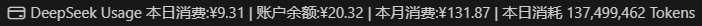
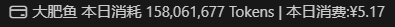
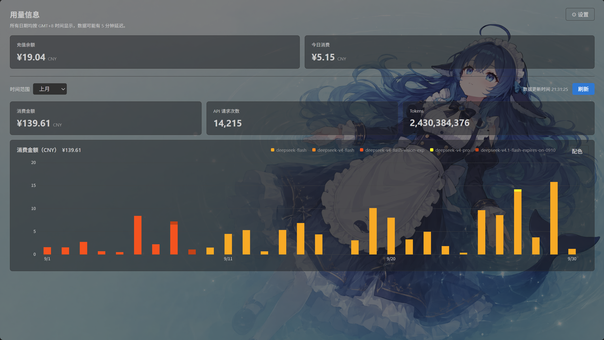

# DeepSeek Usage Monitor & Dashboard

在 VSCode 里实时查看 DeepSeek API 的余额与用量：状态栏可自定义显示信息，详情面板复刻官网用量页风格，用量一目了然。

    

**简体中文** ｜ [English](README.en.md)

## 特点：为什么是这个扩展？

### 1. 高度自定义

- **可自定义状态栏信息显示**：底栏右侧常驻显示本日消费 / 本月消费 / 账户余额 / 本日消耗token，状态栏标签、显示项目种类和顺序可随意配置
  
  
- **可自定义仪表盘面板背景**：图片/纯色/渐变背景随心选！图片随页面大小自动缩放，在美观的同时依旧保证信息和文字清晰可读
  
- **可自定义配色 Official 风格柱状图**：包含三种模式：官方色阶/按模型单独指定颜色/设定单主色自动阶梯，包含取色器和RGB/HSL/HEX颜色指定模式
  - 官方色阶：与 DeepSeek 用量页同款
  - 按模型指定：每个模型一个颜色，未指定自动回落官方色阶
  - 单主色阶梯：只选一个主色，按模型数量自动铺开由浅到深的同色系颜色
- **可自定义数据同步频率**：可自由设置刷新频率，默认1分钟刷新一次

### 2. 贴心的细节

- **一目了然的仪表板：** 包含充值余额、今日消费、自定义区间消费金额 / API 请求次数 / Tokens 统计 & 按模型统计消费柱状图
- **支持中英文切换**：设置面板语言自动跟随VSCode全局设置，详情面板&报错通知语言可自定义配置，默认简体中文
- **API Token 加密存储：** API Key 保存在 VSCode SecretStorage中，保护你的隐私安全
- **支持 HTTP 代理**：继承自原项目

## 配置

在设置中搜索 `deepseek-usage-monitor`，或编辑 `settings.json`：

| 配置项                                               | 说明                                                                                                                               | 必填         |
| ---------------------------------------------------- | ---------------------------------------------------------------------------------------------------------------------------------- | ------------ |
| `API Key`                                          | 点击详情面板中的“设置 API Key”按钮进行设置                                                                                       | 是           |
| `deepseek-usage-monitor.sessionToken`              | Session Token (`Bearer ...`)，用于查询用量                                                                                       | 是           |
| `deepseek-usage-monitor.cookie`                    | 浏览器 Cookie，与 Session Token 配合使用                                                                                           | 是           |
| `deepseek-usage-monitor.proxy`                     | HTTP 代理地址                                                                                                                      | 否           |
| `deepseek-usage-monitor.language`                  | 显示语言：`en` / `zh-cn`                                                                                                       | 否(默认简中) |
| `deepseek-usage-monitor.statusBar.items`           | 状态栏显示项（数组，顺序即显示顺序）：`todayCost` / `monthCost` / `balance` / `todayTokens`，默认 `[todayCost, balance]` | 否           |
| `deepseek-usage-monitor.refreshInterval`           | 自动刷新间隔（单位：分钟），默认`1`；可填小数（`0.5` = 30 秒），设为 `0` 则关闭自动刷新                                      | 否           |
| `deepseek-usage-monitor.dashboard.backgroundColor` | 面板背景：CSS 颜色或渐变（如`#0b1220`、`linear-gradient(135deg,#0b1220,#1b2a4a)`），留空跟随主题                               | 否           |
| `deepseek-usage-monitor.dashboard.backgroundDim`   | 背景图之上的暗化程度`0`–`0.9`（默认 `0.4`），用于保证文字可读性，仅对图片生效                                               | 否           |
| `deepseek-usage-monitor.dashboard.cardOpacity`     | 有自定义背景时卡片底色的不透明度`0.3`–`1`（默认 `0.82`；浅色主题自动 +0.06）                                                | 否           |

> 图表配色（官方色阶 / 按模型指定 / 单主色阶梯）不作为设置项：在面板柱状图卡片右上角点「配色」按钮设置，随面板状态保存。
> 背景图与配置迁移也可从面板右上角「⚙ 设置」菜单进入。

### 如何获取 Session Token 和 Cookie（2026.9实测）

1. 浏览器登录进入 **Usage** 页面 [platform.deepseek.com/usage](https://platform.deepseek.com/usage)
2. 按 `F12` → **Network(网络)/右键菜单'检查'** → 找到 `cost?start=xxx` 请求
3. 复制 Authorization 请求头的全部内容（Bearer xxxxxx），填入设置项中的Session Token即可
4. 获取方式同上，一般在 Authorization 请求头的下面就是 Cookie 请求头，复制其全部内容填入设置项中的Cookie即可

> Session Token / Cookie 会过期，数据刷新失败时请重新获取。

## 命令

| 命令                                                   | 说明                                                                 |
| ------------------------------------------------------ | -------------------------------------------------------------------- |
| `DeepSeek Usage Monitor: Open Dashboard`             | 打开用量面板                                                         |
| `DeepSeek Usage Monitor: Refresh`                    | 手动刷新                                                             |
| `DeepSeek Usage Monitor: Set API Key`                | 设置 API Key（写入 SecretStorage）                                   |
| `DeepSeek Usage Monitor: Set Dashboard Background`   | 选择图片作为面板背景（复制进扩展存储，与主题色/渐变可共存）          |
| `DeepSeek Usage Monitor: Clear Dashboard Background` | 清除面板背景图                                                       |
| `DeepSeek Usage Monitor: Export Configuration`       | 把设置与面板状态导出为 JSON（不含 Session Token / Cookie / API Key） |
| `DeepSeek Usage Monitor: Import Configuration`       | 读取配置文件并覆盖同名项（写入用户设置与扩展状态）                   |

## 数据与隐私

- 所有请求只发往 DeepSeek 官方域名（`api.deepseek.com`、`platform.deepseek.com`），不经过任何第三方服务器
- 用量接口依赖平台内部 API（`platform.deepseek.com/api/v0/usage/*`），DeepSeek 官方改动网页接口时可能失效
- API Key 保存在 VSCode **SecretStorage**（`deepseek-usage-monitor.apiKey`）中（若密码管理器异常不可用则降级到内存缓存模式，API Key仅当次会话有效，重启后需重新配置）
- Session Token 与 Cookie 因可能需要不定期更新，保存在 VSCode 设置中（明文 `settings.json`），**请务必注意数据安全**
- 若配置了 `proxy`，请求会经该代理转发

## 致谢

- 原始项目：[linnin233 / ds-usage-cost](https://github.com/linnin233/deepseek-usage-vscode)（MIT），本项目在其基础上修改重构，力求实现更好的信息展示、更稳定的表现和更丰富实用的功能。
